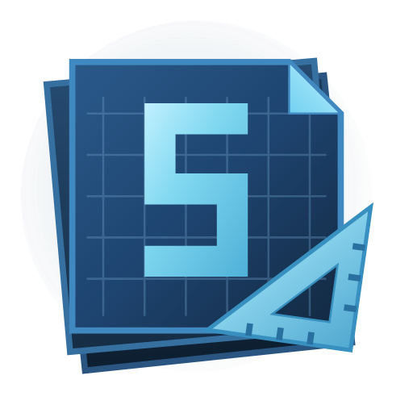

<a id="readme-top"></a>

<!--
Screenshots to add before publishing the listing:
  docs/images/library.png      the library grid with pinned bundle tabs
  docs/images/template.png     the Schematicraft button on the Template Manager
  docs/images/camera.png       camera mode overlay
Then swap them into the About The Project section below.
-->

<div align="center">



# Schematicraft

Your [schematicraft.com](https://schematicraft.com) schematic library, inside Minecraft.

Browse, search, download, and upload schematics through the building tools you already use.

[![Release][release-shield]][releases-url]
[![License][license-shield]][license-url]
[![Minecraft][mc-shield]][mc-url]
[![NeoForge][neoforge-shield]][neoforge-url]
[![Issues][issues-shield]][issues-url]

[Website](https://schematicraft.com) &middot; [Report a bug][issues-url] &middot; [Request a feature][issues-url]

</div>

<details>
  <summary>Contents</summary>

- [About The Project](#about-the-project)
  - [Supported Editors](#supported-editors)
  - [Built With](#built-with)
- [Getting Started](#getting-started)
  - [Prerequisites](#prerequisites)
  - [Installation](#installation)
- [Usage](#usage)
  - [Keybinds](#keybinds)
  - [Block Palettes](#block-palettes)
- [Multiplayer](#multiplayer)
- [Building From Source](#building-from-source)
- [Versioning](#versioning)
  - [Pre-release Stages](#pre-release-stages)
  - [Tags](#tags)
- [Roadmap](#roadmap)
- [Contributing](#contributing)
- [License](#license)
- [Acknowledgments](#acknowledgments)

</details>

## About The Project

Schematicraft connects Minecraft to a cloud schematic library. Instead of shuffling `.nbt` and `.schem` files between your downloads folder and your saves directory, you browse your library in game and load a build straight into the tool you are holding.

Uploading works the same way in reverse. Copy a build with a gadget, or point the camera at it, and send it to your library without leaving the world.

Conversion happens server side, so a schematic uploaded from one editor can be downloaded into a different one.

### Supported Editors

| Editor             | Integration                   | Server mod needed              |
| ------------------ | ----------------------------- | ------------------------------ |
| Building Gadgets 2 | Copy/Paste gadget radial menu | Yes, for direct gadget loading |
| Building Gadgets 2 | Template Manager              | No                             |
| Create             | Schematic Table side panel    | No                             |

Both editors are optional. The mod detects what is installed and activates only the matching integration. With neither installed it still loads, and you can browse and download, but there is nowhere to load a schematic into.

### Built With

[![Java][java-shield]][java-url]
[![Gradle][gradle-shield]][gradle-url]
[![NeoForge][neoforge-shield]][neoforge-url]

## Getting Started

### Prerequisites

- Minecraft 1.21.1
- NeoForge for 1.21.1, version 21.1 or newer
- A free [schematicraft.com](https://schematicraft.com) account
- At least one supported editor mod, for loading builds in game

### Installation

This is an alpha. It works, but expect rough edges, and the config format may still change. See [Versioning](#versioning).

1. Download the latest `schematicraft-1.21.1-<version>.jar` from the [releases page][releases-url].
2. Drop it into your `mods` folder.
3. Launch Minecraft and press <kbd>N</kbd>.
4. Paste your API key from [schematicraft.com/account](https://schematicraft.com/account) and choose Validate.

Your library loads as soon as the key is accepted. The key is stored in `config/schematicraft.properties` and is sent only to the endpoint named in that file.

You can also reach the key screen from the **Schematicraft** button on a Template Manager or Schematic Table.

## Usage

Press <kbd>N</kbd> to open the library. Filter as you type, arrow keys to move, <kbd>Enter</kbd> to load into whatever tool you are holding.

Pin up to seven bundles as tabs for the builds you use constantly, then jump straight to them with a hotkey. Downloaded files are cached locally, so loading the same schematic twice is instant.

### Keybinds

| Key                                                 | Action                       |
| --------------------------------------------------- | ---------------------------- |
| <kbd>N</kbd>                                        | Open Schematicraft           |
| <kbd>Ctrl</kbd> + <kbd>1</kbd> to <kbd>7</kbd>      | Jump to a pinned bundle      |
| <kbd>Ctrl</kbd> + <kbd>Tab</kbd>                    | Next bundle                  |
| <kbd>Ctrl</kbd> + <kbd>Shift</kbd> + <kbd>Tab</kbd> | Previous bundle              |
| <kbd>Ctrl</kbd> + <kbd>U</kbd>                      | Upload                       |
| <kbd>Ctrl</kbd> + <kbd>K</kbd>                      | Camera mode                  |
| <kbd>Ctrl</kbd> + <kbd>P</kbd>                      | Block palettes               |
| <kbd>Tab</kbd>                                      | Cycle the action buttons     |
| Arrow keys                                          | Move through the grid        |
| <kbd>Enter</kbd>                                    | Load the selected schematic  |
| <kbd>Esc</kbd>                                      | Clear the filter, then close |

A second keybind for opening the key screen directly is registered but unbound. Assign it in Options if you want it.

### Block Palettes

A palette swaps one set of blocks for another at download time, so an oak build arrives as spruce. Palettes are created and edited on [schematicraft.com](https://schematicraft.com); in game you pick an existing one and apply it. The swap happens server side, then the result loads into your editor.

## Multiplayer

The mod is client side and works on any server. Nothing is required of the server for browsing, downloading, uploading, camera mode, or the Template Manager and Schematic Table integrations.

Installing it on the server as well unlocks loading directly into a held Building Gadgets 2 gadget, which needs a server round trip.

## Building From Source

This repository does not build on its own. `build.gradle` pulls two sibling repositories in as source directories, at fixed relative paths, so the checkout layout matters.

```
workspace/
  api-clients/              clone of schematicraft-api, folder must be named api-clients
  mods/
    schematicraft-mod/      this repository
    schematicraft-lib/      shared editor-agnostic library
```

The `mods` level can be named anything, but it has to exist, because the API client is resolved two levels up.

```sh
mkdir -p workspace/mods
cd workspace
git clone https://github.com/DeMux42/schematicraft-api.git api-clients
cd mods
git clone https://github.com/DeMux42/schematicraft-lib.git
git clone https://github.com/DeMux42/schematicraft-mod.git
cd schematicraft-mod
./gradlew build
```

Requires JDK 21. The jar lands in `build/libs` as `schematicraft-1.21.1-<version>.jar`.

The two source directories are `../schematicraft-lib/src/main/java` and `../../api-clients/java/src`. Neither is version pinned, so keep all three repositories on matching branches.

Building Gadgets 2 and Create resolve from CurseMaven as compile-time dependencies. To verify behavior when an editor is missing:

```sh
./gradlew runClient -PwithBG2=false
./gradlew runClient -PwithCreate=false
./gradlew runClient -PwithBG2=false -PwithCreate=false
```

## Versioning

Jars are named `schematicraft-<mcversion>-<modversion>.jar`, so a build for one Minecraft version can never be mistaken for another in your mods folder.

The mod version is semver, and since nothing compiles against a mod, the three numbers are a message to you rather than an API contract:

| Bump  | Means                                                                                |
| ----- | ------------------------------------------------------------------------------------ |
| PATCH | Fixes only, drop it in                                                               |
| MINOR | New features, new editor integrations, new screens                                   |
| MAJOR | You have to do something: reconfigure, re-enter your key, or a stored format changed |

### Pre-release Stages

Alpha and beta builds say so in the version string, not only in the download channel, so the marker survives being downloaded and renamed:

| Version         | Means                                     |
| --------------- | ----------------------------------------- |
| `0.4.0-alpha.N` | Early. Expect breakage and rough edges.   |
| `0.4.0-beta.N`  | Feature complete, still shaking out bugs. |
| `0.4.0`         | Released.                                 |

Semver sorts those in that order, so promoting a build is a rename with nothing to unwind.

**The current build is an alpha.** Things will break, and the config format is not settled yet. If you hit something, the [issue tracker][issues-url] is the place. In-game feedback on a download is also useful, since that is what tells us a conversion path is wrong.

### Tags

Releases are tagged `v<modversion>+mc<mcversion>`, for example `v0.4.0-alpha.1+mc1.21.1`. The `+` portion is semver build metadata, which version comparisons ignore. That keeps a future 1.26 build from having to burn a version number just to be distinguishable, since the same feature set can ship as `v0.5.0+mc1.21.1` and `v0.5.0+mc1.26`.

Still on 0.x. Reaching 1.0.0 is a commitment to hold the config and key storage formats still, which has not been earned yet.

## Roadmap

- [x] Building Gadgets 2 integration, radial menu and Template Manager
- [x] Create Schematic Table integration
- [x] Camera mode for schematic screenshots
- [x] Apply block palettes at download time
- [ ] Minecraft 26.1 port, see `PORTING-26.1.md`
- [ ] Litematica integration
- [ ] Axiom integration
- [ ] Translations, currently English only

See [open issues][issues-url] for the full list.

## Contributing

Issues and pull requests are welcome.

1. Fork the repository
2. Create a branch (`git checkout -b feature/thing`)
3. Commit your changes
4. Push and open a pull request

Two things to know before you start. The shared library in `schematicraft-lib` must stay editor agnostic and must never import editor types; editor-specific code belongs in this repository. And never commit an API key, including in tests. A CI check rejects them.

## License

Distributed under the GNU Lesser General Public License v3.0. See [`LICENSE`](LICENSE) for the LGPL terms and [`COPYING`](COPYING) for the GPL terms it builds on.

## Acknowledgments

- [Building Gadgets 2](https://www.curseforge.com/minecraft/mc-mods/building-gadgets) by Direwolf20
- [Create](https://www.curseforge.com/minecraft/mc-mods/create) by simibubi and the Create team
- [NeoForge](https://neoforged.net/)
- README structure based on [Best-README-Template](https://github.com/othneildrew/Best-README-Template)

<p align="right"><a href="#readme-top">Back to top</a></p>

[release-shield]: https://img.shields.io/github/v/release/DeMux42/schematicraft-mod?include_prereleases&sort=semver
[license-shield]: https://img.shields.io/badge/license-LGPL--3.0-blue.svg
[license-url]: LICENSE
[mc-shield]: https://img.shields.io/badge/Minecraft-1.21.1-brightgreen.svg
[mc-url]: https://www.minecraft.net/
[neoforge-shield]: https://img.shields.io/badge/NeoForge-21.1-orange.svg
[neoforge-url]: https://neoforged.net/
[issues-shield]: https://img.shields.io/github/issues/DeMux42/schematicraft-mod.svg
[issues-url]: https://github.com/DeMux42/schematicraft-mod/issues
[releases-url]: https://github.com/DeMux42/schematicraft-mod/releases
[java-shield]: https://img.shields.io/badge/Java-21-red.svg
[java-url]: https://adoptium.net/
[gradle-shield]: https://img.shields.io/badge/Gradle-8.10-02303A.svg
[gradle-url]: https://gradle.org/
